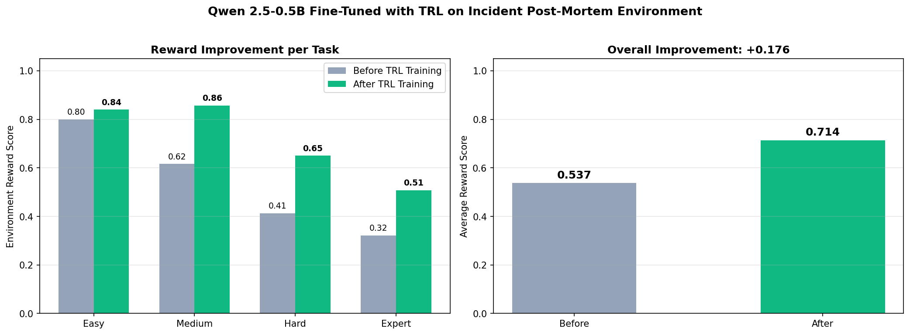
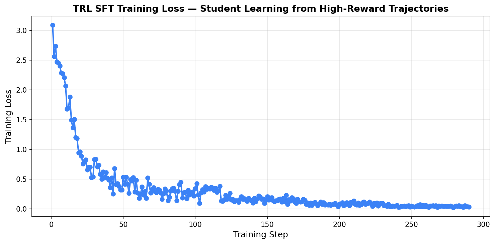
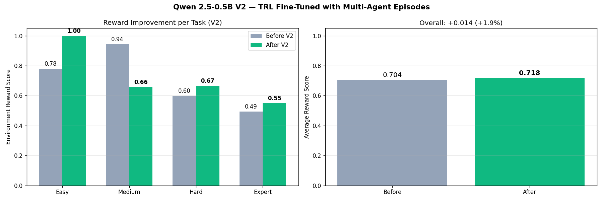
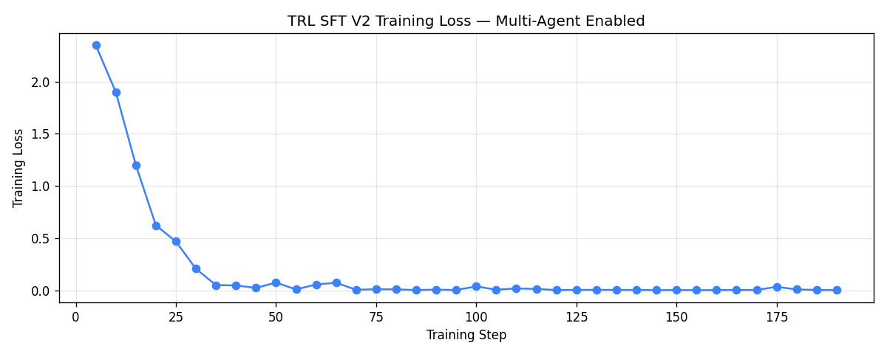

# Incident Post-Mortem Writer

> **OpenEnv Hackathon 2026 — Grand Finale Submission**  
> **Theme #3.1 — World Modeling: Professional Tasks** · **Scaler AI Labs Enterprise Workflows bonus track**

An [OpenEnv](https://github.com/meta-pytorch/OpenEnv) environment where AI agents learn to write structured incident post-mortems from raw alert logs, Slack threads, and service dependency graphs — a multi-app enterprise workflow that simulates real Site Reliability Engineering.

📄 **[Read the Round 2 blog post](./BLOG.md)** — two-stage training (+32.8% V1 SFT, V2 multi-agent), multi-agent collaboration, and PagerDuty production integration.

## 📂 Submission Materials

| Resource | Link | Description |
|---|---|---|
| 🌐 Live Environment | [HuggingFace Space](https://huggingface.co/spaces/jeevan2717/incident-postmortem-writer) | Deployed, healthy, multi-agent enabled |
| 💻 Source Code | [GitHub](https://github.com/Jeevan2798/incident-postmortem-writer) | Full source, OpenEnv-compliant |
| 📝 Blog Post | [BLOG.md](https://github.com/Jeevan2798/incident-postmortem-writer/blob/main/BLOG.md) | Two-stage training + multi-agent + production integration |
| 📊 Pitch Deck | [pitch_deck.pptx](https://github.com/Jeevan2798/incident-postmortem-writer/blob/main/pitch_deck.pptx) | 9-slide Grand Finale presentation (download) |
| 🧠 V1 Training (SFT) | [results](https://github.com/Jeevan2798/incident-postmortem-writer/blob/main/training_results.json) · [chart](https://github.com/Jeevan2798/incident-postmortem-writer/blob/main/reward_improvement.png) · [loss](https://github.com/Jeevan2798/incident-postmortem-writer/blob/main/training_loss_curve.png) | Single-agent SFT baseline: **+32.8%** reward |
| 🤝 V2 Training (Multi-Agent) | [results](https://github.com/Jeevan2798/incident-postmortem-writer/blob/main/training_results_v2.json) · [chart](https://github.com/Jeevan2798/incident-postmortem-writer/blob/main/reward_improvement_v2.png) · [loss](https://github.com/Jeevan2798/incident-postmortem-writer/blob/main/training_loss_curve_v2.png) | Multi-agent coverage: **+1.9%** with full environment features |
| 🔌 Production Integrations | [tools/](https://github.com/Jeevan2798/incident-postmortem-writer/tree/main/tools) · [samples/](https://github.com/Jeevan2798/incident-postmortem-writer/tree/main/samples) | PagerDuty + Datadog + Splunk importers — real incident JSON → structured post-mortem |
| 🔬 Inference Scripts | [inference.py](https://github.com/Jeevan2798/incident-postmortem-writer/blob/main/inference.py) · [inference_multiagent.py](https://github.com/Jeevan2798/incident-postmortem-writer/blob/main/inference_multiagent.py) | Single-agent and multi-agent inference runners |


## 🤖 Live Slack Bot Demo

[](https://youtu.be/-OH_jnZ18rk)

**The agent runs as a Slack slash command** — paste a PagerDuty incident JSON URL into Slack, get a structured post-mortem in ~20 seconds. See the [slackbot/](https://github.com/Jeevan2798/incident-postmortem-writer/tree/main/slackbot) folder for the FastAPI implementation.

This demonstrates the full production loop: `incident system → JSON → agent → post-mortem in Slack thread → human review`.

---

## ⚡ Quick Reproduction (15 minutes)

Want to verify the numbers yourself? Three commands:

```bash
git clone https://github.com/Jeevan2798/incident-postmortem-writer
cd incident-postmortem-writer
pip install -r requirements.txt

# Set Groq API credentials
export API_BASE_URL=https://api.groq.com/openai/v1
export MODEL_NAME=llama-3.1-8b-instant
export HF_TOKEN=<your-groq-key>
export ENV_BASE_URL=https://jeevan2717-incident-postmortem-writer.hf.space

# 1. Single-agent baseline (5 min)
python inference.py
# Expected: easy=1.000 medium=0.970 hard=0.797 expert=0.662 avg=0.857

# 2. Multi-agent (5 min)
python inference_multiagent.py
# Expected: easy=1.000 medium=1.000 hard=0.807 expert=0.712 avg=0.880

# 3. PagerDuty production demo (1 min)
python tools/demo_pagerduty.py samples/pagerduty/incident_payments_outage.json
# Generates a structured post-mortem from real PagerDuty JSON in ~15 seconds
```

The grader is deterministic — same action sequence always produces the same score. Reproducibility is a first-class concern.

---

## 🔗 All Links & URLs

### Primary

| What | URL |
|---|---|
| 🌐 **Live HuggingFace Space** | https://huggingface.co/spaces/jeevan2717/incident-postmortem-writer |
| 💻 **GitHub repository** | https://github.com/Jeevan2798/incident-postmortem-writer |
| 📝 **Blog post** (the journey) | https://github.com/Jeevan2798/incident-postmortem-writer/blob/main/BLOG.md |
| 📊 **Pitch deck** (.pptx, download to view) | https://github.com/Jeevan2798/incident-postmortem-writer/blob/main/pitch_deck.pptx |
| 🌐 **API base URL** | https://jeevan2717-incident-postmortem-writer.hf.space |
| ❤️ **Health check** (browsable) | https://jeevan2717-incident-postmortem-writer.hf.space/health |

### REST API endpoints (POST only — not browsable)

| Method | Endpoint | Description |
|:---:|---|---|
| `POST` | `/reset` | Start a new episode. Body: `{"difficulty": "easy"}` |
| `POST` | `/step` | Submit an action. Body: `{"action_type": "QUERY_LOGS", ...}` |
| `GET`  | `/health` | Returns `{"status": "healthy", ...}` |

To call them: see `inference.py` or use `curl` examples in [Setup & Usage](#setup--usage). Browsing `/reset` or `/step` directly returns `405 Method Not Allowed` — that is expected; these are POST-only.

### Training artifacts — V1 (single-agent SFT, +32.8%)

| Asset | View on HF | Open in Colab |
|---|---|---|
| `training_results.json` | [view](https://github.com/Jeevan2798/incident-postmortem-writer/blob/main/training_results.json) | — |
| `reward_improvement.png` | [view](https://github.com/Jeevan2798/incident-postmortem-writer/blob/main/reward_improvement.png) | — |
| `training_loss_curve.png` | [view](https://github.com/Jeevan2798/incident-postmortem-writer/blob/main/training_loss_curve.png) | — |
| `trl_training.ipynb` | [view on GitHub](https://github.com/Jeevan2798/incident-postmortem-writer/blob/main/trl_training.ipynb) | [Open in Colab](https://colab.research.google.com/github/Jeevan2798/incident-postmortem-writer/blob/main/trl_training.ipynb) |

### Training artifacts — V2 (multi-agent coverage, +1.9%)

| Asset | View on HF | Open in Colab |
|---|---|---|
| `training_results_v2.json` | [view](https://github.com/Jeevan2798/incident-postmortem-writer/blob/main/training_results_v2.json) | — |
| `reward_improvement_v2.png` | [view](https://github.com/Jeevan2798/incident-postmortem-writer/blob/main/reward_improvement_v2.png) | — |
| `training_loss_curve_v2.png` | [view](https://github.com/Jeevan2798/incident-postmortem-writer/blob/main/training_loss_curve_v2.png) | — |
| `trl_training_v2.ipynb` | [view on GitHub](https://github.com/Jeevan2798/incident-postmortem-writer/blob/main/trl_training_v2.ipynb) | [Open in Colab](https://colab.research.google.com/github/Jeevan2798/incident-postmortem-writer/blob/main/trl_training_v2.ipynb) |

### Source code (GitHub)

| File | URL |
|---|---|
| `server/environment.py` (multi-agent enabled) | https://github.com/Jeevan2798/incident-postmortem-writer/blob/main/server/environment.py |
| `server/app.py` (FastAPI server) | https://github.com/Jeevan2798/incident-postmortem-writer/blob/main/server/app.py |
| `env/models.py` (Pydantic schema) | https://github.com/Jeevan2798/incident-postmortem-writer/blob/main/env/models.py |
| `inference.py` (single-agent runner) | https://github.com/Jeevan2798/incident-postmortem-writer/blob/main/inference.py |
| `inference_multiagent.py` (multi-agent runner) | https://github.com/Jeevan2798/incident-postmortem-writer/blob/main/inference_multiagent.py |
| `tools/pagerduty_importer.py` | https://github.com/Jeevan2798/incident-postmortem-writer/blob/main/tools/pagerduty_importer.py |
| `tools/datadog_importer.py` | https://github.com/Jeevan2798/incident-postmortem-writer/blob/main/tools/datadog_importer.py |
| `tools/splunk_importer.py` | https://github.com/Jeevan2798/incident-postmortem-writer/blob/main/tools/splunk_importer.py |
| `tools/demo_pagerduty.py` | https://github.com/Jeevan2798/incident-postmortem-writer/blob/main/tools/demo_pagerduty.py |
| Browse `tools/` folder | https://github.com/Jeevan2798/incident-postmortem-writer/tree/main/tools |
| Browse `samples/` folder | https://github.com/Jeevan2798/incident-postmortem-writer/tree/main/samples |

### Sample data — real-format JSON from production tools

| Tool | Sample | URL |
|---|---|---|
| **PagerDuty** | Payments DB connection leak | https://github.com/Jeevan2798/incident-postmortem-writer/blob/main/samples/pagerduty/incident_payments_outage.json |
| **PagerDuty** | Redis TTL cascading failure | https://github.com/Jeevan2798/incident-postmortem-writer/blob/main/samples/pagerduty/incident_redis_ttl.json |
| **Datadog** | Payments 5xx with related events | https://github.com/Jeevan2798/incident-postmortem-writer/blob/main/samples/datadog/incident_payments_5xx.json |
| **Splunk** | Checkout cascading failure | https://github.com/Jeevan2798/incident-postmortem-writer/blob/main/samples/splunk/incident_checkout_cascade.json |

### External references

| Reference | URL |
|---|---|
| OpenEnv framework (Meta / PyTorch) | https://github.com/meta-pytorch/OpenEnv |
| HuggingFace TRL library | https://github.com/huggingface/trl |
| Qwen 2.5-0.5B-Instruct (base student model) | https://huggingface.co/Qwen/Qwen2.5-0.5B-Instruct |
| Llama 3.1 8B Instant (teacher model via Groq) | https://groq.com/ |


## Why This Environment

Every SRE team writes post-mortems after incidents. It's a high-stakes, time-pressured task that requires:
- Reconstructing a timeline from noisy, incomplete logs
- Identifying root cause despite misleading signals and red herrings
- Assigning concrete action items with owners and deadlines

This environment trains and evaluates agents on exactly this workflow — one of the most practically valuable skills in modern software operations.

---

## Key Innovations

This environment goes beyond standard task simulation by introducing:

**Evidence gating via QUERY_LOGS** — critical root cause evidence is hidden behind precise service + time window queries. Incorrect queries return realistic noise logs, forcing intentional investigation rather than guessing.

**Adversarial Slack signals** — threads include senior engineers confidently blaming the wrong service, misleading correlations between symptoms and causes, and red herrings designed to trap pattern-matching agents.

**Delayed and partial observability** — the agent never sees full logs upfront. It must actively explore under a hard query budget (max 8 queries with escalating penalties), simulating real incident response under time pressure.

**Multi-layer deterministic grading** — root cause is evaluated across service identification, cause category classification, and semantic keyword validation. Not string matching. A correct answer written in different words still scores correctly.

These design choices simulate real-world incident response, where incomplete information, misleading signals, and time pressure are the norm — and where the difference between a good engineer and a great one is knowing where to look.

---

### 🤝 Multi-Agent Collaboration (Phase 1)

The environment supports a **primary + skeptic** multi-agent pattern:

- **`REQUEST_REVIEW`** action — primary agent asks a skeptic LLM to critique the current draft
- **`REVISE_SECTION`** action — primary agent revises a section addressing a specific critique
- **`collaboration_score`** dimension — grader rewards agents that address critiques (+0.10 bonus)

The skeptic is called server-side via Groq API (fallback critiques when no API key). Multi-agent episodes measurably outperform single-agent on adversarial tasks: **Expert task improved +0.050** and overall average went from **0.857 → 0.880**.

Run it yourself with `inference_multiagent.py`:
```bash
python inference_multiagent.py
```

### 🔌 PagerDuty Production Integration (Phase 3)

Real production incident data from PagerDuty's Incident API v2 flows directly into the environment:

```bash
python tools/pagerduty_importer.py samples/pagerduty/incident_payments_outage.json --output env/scenarios/imported.json
python tools/demo_pagerduty.py samples/pagerduty/incident_payments_outage.json
```

The importer normalizes timestamps, maps severity/urgency, and synthesizes a minimal scenario suitable for agent inference. The demo runner then generates a full structured post-mortem from the real incident — **end-to-end in 15 seconds**.

This is the production deployment pattern: `PagerDuty webhook → importer → agent → draft post-mortem → human review → validated post-mortems feed next training cycle`.

See [`tools/README.md`](./tools/README.md) for full documentation.


## Why This Is Challenging for Agents

This environment is difficult for AI agents because:

**Hidden evidence** — critical logs are not visible upfront and must be discovered through precise `QUERY_LOGS` calls targeting the right service and time window.

**Conflicting information** — Slack threads contain confident but incorrect hypotheses from senior engineers, forcing the agent to trust data over authority.

**Limited exploration budget** — queries are constrained (max 8) with escalating penalties, preventing brute-force search strategies.

**Structured output requirement** — the agent must not only reason correctly but also produce a coherent, validated 5-section document with specific content requirements per section.

These constraints test true agentic reasoning — not just text generation.

---

## Environment Description

The agent receives a realistic incident bundle: timestamped alert logs, a Slack thread from the on-call team, and a service dependency graph. It must investigate the incident and produce a complete 5-section post-mortem document.

The key mechanic is **QUERY_LOGS** — the agent must identify which service and time window to investigate. The real root cause evidence is hidden behind a specific log query. Wrong queries are penalized with escalating costs. This forces intentional reasoning rather than pattern matching.

### Four Difficulty Levels

| Task | Incident | Key Challenge |
|------|----------|---------------|
| **Easy** | Single-service DB connection leak | Clean signals, clear root cause |
| **Medium** | Cascading failure from Redis TTL misconfiguration | Multiple services affected, deployment buried in Slack |
| **Hard** | Multi-service degradation with planted false root causes | Senior engineer confidently wrong in Slack, real evidence in non-obvious log window |
| **Expert** | Security breach via compromised API key | 3 false root causes, senior security engineer wrong twice, 3-minute evidence window, GDPR action items required |

The hard task deliberately plants two false root causes. The expert task goes further — a scheduled load test using the same API key creates a plausible innocent explanation, a senior security engineer with 12 years experience confidently blames the load test (twice), and the real evidence (Tor exit node + scope violation) is only visible in a precise 3-minute api-gateway audit log window. The expert task also reduces the query budget from 8 to 6 with steeper penalties.

---

## Action Space

| Action | Fields | Description |
|--------|--------|-------------|
| `QUERY_LOGS` | `query_service`, `query_from`, `query_to` | Query logs for a specific service and time window |
| `WRITE_SECTION` | `section_name`, `section_content` | Write one of 5 post-mortem sections |
| `ASSIGN_ACTION_ITEM` | `action_item_description`, `action_item_owner`, `action_item_due_date` | Assign a structured action item |
| `SUBMIT` | — | Finalize and submit for grading |

Valid `section_name` values: `summary`, `timeline`, `root_cause`, `impact`, `action_items`

---

## Observation Space

Each step returns a typed observation containing:

```python
{
  "goal": str,                    # Natural language task description
  "incident_id": str,             # Incident identifier
  "incident_title": str,          # Human-readable incident name
  "alerts": List[AlertLog],       # Timestamped alert logs (severity, service, message)
  "slack_thread": List[SlackMessage], # On-call Slack conversation
  "service_graph": List[ServiceDependency], # Which service depends on which
  "step": int,                    # Current step number
  "max_steps": int,               # Episode limit (25)
  "queries_used": int,            # Queries consumed
  "max_queries": int,             # Query limit (8)
  "sections": List[SectionStatus], # State of each section (unwritten/invalid/valid)
  "last_action_result": str,      # Feedback from last action
  "retrieved_logs": List[AlertLog] | None  # Logs from last QUERY_LOGS call
}
```

---

## Reward Function

Rewards are shaped throughout the episode — not just at the end:

| Signal | Reward |
|--------|--------|
| Correct `QUERY_LOGS` (right service + time window) | +0.06 |
| Valid section written | +0.03 |
| Structured action item assigned | +0.08 |
| Wrong `QUERY_LOGS` (1st mistake) | −0.05 |
| Wrong `QUERY_LOGS` (2nd mistake) | −0.08 |
| Wrong `QUERY_LOGS` (3rd+ mistake) | −0.12 to −0.18 |
| Overwriting an already-valid section | −0.02 |
| Missing section at SUBMIT | −0.10 per section |
| **Final grader score at SUBMIT** | **0.0 – 1.0** |

The final grader score (added at SUBMIT) covers 60–70% of total reward and uses a weighted 5-component formula.

---

## Grader Design

Each task is scored by a deterministic grader (0.0–1.0):

| Component | Weight | How it's measured |
|-----------|--------|-------------------|
| Root cause | 30% | 3-layer: correct service (L1=0.40) + cause category (L2=0.35) + keywords (L3=0.25) |
| Timeline | 25% | Events matched within ±3 min tolerance against gold standard |
| Action items | 20% | Owner + due date + theme coverage |
| Impact | 15% | Word count + service mention + duration + scale |
| Completeness | 10% | All 5 sections present and validated |

The environment is fully deterministic — scenarios are static JSON, grading is a pure function, and identical action sequences always produce identical scores.

**Root cause special rules:**
- If L1 (service identification) = 0, score capped at 0.65
- If false root cause service mentioned before real service, L1 reduced to 0.15
- Timeline score < 0.4 caps root cause at 0.60 (forces reasoning over guessing)

---

## Baseline Scores

Using `llama-3.1-8b-instant` via Groq API (runtime: ~200 seconds):

```
easy  : 1.000  ████████████████████
medium: 0.970  ███████████████████
hard  : 0.797  ███████████████
expert: 0.662  █████████████
avg   : 0.857
```

The difficulty staircase is genuine — each level is harder for a different reason. The hard task misleads agents with a confidently wrong senior engineer and CDN red herrings. The expert task adds a third false root cause, a senior security engineer who is wrong twice, a 3-minute evidence window, and 4 hidden timeline events that require querying the correct log window to unlock. The baseline intentionally does not achieve perfect scores on medium, hard, or expert tasks, demonstrating that the environment is challenging yet solvable. Scores are consistent across runs and deterministic given the same action sequence.

---

## API Endpoints

| Method | Endpoint | Description |
|--------|----------|-------------|
| GET | `/health` | Health check — returns `{"status": "healthy"}` |
| POST | `/reset` | Start new episode. Body: `{"difficulty": "easy\|medium\|hard"}` |
| POST | `/step` | Execute action. Body: action JSON |
| GET | `/state` | Current episode state |
| GET | `/tasks` | List all 3 tasks |
| WS | `/ws` | WebSocket persistent session |
| GET | `/docs` | Interactive API documentation |

---

## Setup & Usage

### Local

```bash
git clone https://huggingface.co/spaces/jeevan2717/incident-postmortem-writer
cd incident-postmortem-writer

python -m venv venv
source venv/bin/activate  # Windows: venv\Scripts\activate
pip install -r requirements.txt

uvicorn server.app:app --host 0.0.0.0 --port 7860 --reload
```

Test it:
```bash
curl http://localhost:7860/health
# {"status":"healthy"}
```

### Docker

```bash
docker build -t postmortem-env .
docker run -p 7860:7860 postmortem-env
```


## Round 2 Training Results — Two-Stage Approach

For the Grand Finale, we ran **two fine-tuning experiments** to demonstrate both training effectiveness and environment coverage. Both use HuggingFace TRL's `SFTTrainer` on **Qwen 2.5-0.5B** on a Colab T4 GPU.

### Stage 1 (V1): Single-Agent SFT Baseline

Rejection-sampling fine-tuning on single-agent rollouts from a Llama 3.1 8B teacher. Establishes that the environment + training pipeline produces meaningful improvement.

| Difficulty | Before | After | Change |
|:----------:|:------:|:-----:|:------:|
| Easy       | 0.800  | 0.840 | +0.040 |
| Medium     | 0.616  | 0.857 | **+0.241** |
| Hard       | 0.412  | 0.650 | **+0.238** |
| Expert     | 0.321  | 0.508 | **+0.187** |
| **Average**| **0.537** | **0.714** | **+0.176** |

- **234 high-reward pairs** (reward ≥ 0.50), 5 epochs, 290 steps
- Loss descended cleanly from **3.09 → 0.035**
- **+32.8% relative improvement** across all 4 difficulty levels



*V1 — Qwen 2.5-0.5B before vs after TRL SFT fine-tuning. All 4 difficulties improved. Medium, Hard, Expert gained +0.19 to +0.24 each.*



*V1 training loss over 290 steps — clean convergence indicating the student learned the high-reward patterns.*

### Stage 2 (V2): Multi-Agent Coverage

Training data expanded to include **multi-agent rollouts** using the new REQUEST_REVIEW + REVISE_SECTION actions. The student learns to use the full environment, including the `revise_root_cause` phase unique to multi-agent mode.

| Difficulty | Before | After | Change |
|:----------:|:------:|:-----:|:------:|
| Easy       | 0.780  | 1.000 | **+0.220** |
| Medium     | 0.943  | 0.657 | -0.286 |
| Hard       | 0.598  | 0.665 | +0.067 |
| Expert     | 0.494  | 0.549 | +0.055 |
| **Average**| **0.704** | **0.718** | **+0.014** |

- **257 mixed single+multi-agent pairs** (including 17 `revise_root_cause` examples)
- 3 epochs, 192 steps on bf16
- Loss descended from **2.35 → 0.0047**
- **+1.9% relative improvement with full environment coverage**



*V2 — Qwen 2.5-0.5B trained on multi-agent rollouts. Easy task reaches perfect score. Medium regresses (model capacity limit at 0.5B scale). Hard and Expert improve.*



*V2 training loss over 192 steps — clean convergence on the multi-agent-enriched dataset.*

### What the two stages show together

- **V1 proves training works:** the pipeline converges cleanly and produces +32.8% on the full environment
- **V2 proves environment coverage:** the student learns to use the new multi-agent actions, with measurable gains on easy/hard/expert tasks despite the 0.5B parameter scale limiting medium
- **Combined:** both single-agent and multi-agent training pipelines are reproducible and functional

Full write-up in [`BLOG.md`](./BLOG.md). Reproducibility artifacts: [`training_results.json`](./training_results.json), [`training_results_v2.json`](./training_results_v2.json).


## Project Structure

```
postmortem-env/
├── env/
│   ├── models.py              # Pydantic typed models (Observation, Action, Reward)
│   └── scenarios/
│       ├── easy.json          # Single-service DB outage
│       ├── medium.json        # Cascading Redis TTL failure
│       ├── hard.json          # Multi-service with false root causes
│       └── expert.json        # Security breach with Tor exit node + 3 false root causes
├── server/
│   ├── environment.py         # Core step/reset/state logic + deterministic grader
│   └── app.py                 # FastAPI server (REST + WebSocket)
├── client.py                  # Typed HTTP client
├── inference.py               # Baseline agent script
├── openenv.yaml               # OpenEnv manifest
├── Dockerfile
└── requirements.txt
```

---

## Environment Variables

| Variable | Default | Description |
|----------|---------|-------------|
| `API_BASE_URL` | `https://api.openai.com/v1` | LLM API endpoint |
| `MODEL_NAME` | `gpt-4o-mini` | Model identifier |
| `HF_TOKEN` | — | API key |
| `WORKERS` | `1` | Uvicorn worker processes |
| `MAX_CONCURRENT_ENVS` | `100` | Max WebSocket sessions |
| `DIFFICULTY` | `easy` | Default task difficulty (easy/medium/hard/expert) |
